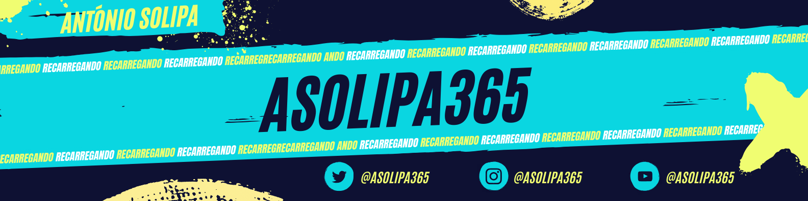

 

<h1 align="center"> < 🌎 Hello World!, Meu nome é <strong>António Solipa</strong>  /> </h1

 
🌱 Natrural de Fundão, Portugal
📍 18 anos & futuro <strong>👨🏼‍💻 Dev Full Stack</strong>.

Sou um profissional dedicado, proativo e empenhado em desenvolver minhas habilidades na área de Desenvolvimento Full Stack; e com muito interesse nas áreas de Front-end, Web e Ui Design. 

Busco continuamente pelo aprendizado e aprimoramento para alcançar resultados positivos e contribuir para o sucesso da equipe e da organização em que atuo.
Estou empenhado em aprimorar minhas habilidades como desenvolvedor.   
Sou estudante na Escola Profissional do Fundão, focado em Programação e Comunicação.

Estou sempre em busca de desafios e oportunidades para aprender e crescer, então...  
😉se você estiver interessado em colaborar ou compartilhar ideias, não hesite em entrar em contato comigo.

 

 

    
    

 

<h1>Minhas Redes Sociais</h1>

    
    
     
     
    
    
     
    

 

  Feito com amor por <a href="https://asolipa365-portfolio.vercel.app/" target="_blank" style="color: #8FE2D9">@asolipa365</a>. 🩵  
  

